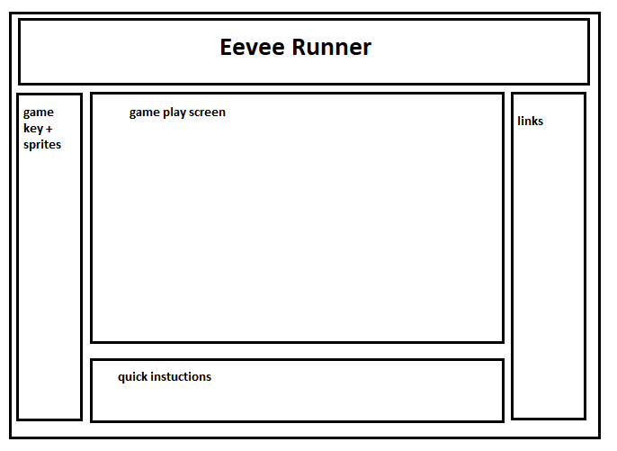

# Background

Eevee Run is a classic runner game based on the Pokemon "eevee". This specific Pokemon has 8 evolution states, based on different elements. The objective of this game is the start off with the starting base Pokemon and collecting elemental stones. At the end of the level the eevee will evolve based on the highest number of stones that was collected. 

** or the level will end based on the criteria of how many of a certain elemental stone that is collected. Each stone will have a certain number of needed to provoke the evolution. Each stone will also have a difficulty level of finding them in a level at random.

# Functionality & MVP
With the game eevee run, users will be able to:
- [ ] left, right walking controls or continuous run function. up to jump.

The main functionality of this game:
- [ ] collect and store stones till the end of the level is reached or till the max number of stones are reached to envoke the evolution.

Game should also include:
- [ ] instuctions of how to play and the goal of the game.
- [ ] a production ReadMe.

Bonus Features:
- [ ] Background change based on the evolution.

# Wireframes

# Technologies 
- Javascript
- HTML5 Canvas
- CSS

### Technical challenges 
The technical challenges that I may face is collecting the correct stones and being able to store and count them according to their designated slots. I plan to solve this by first being able to collect one stone and store and count it properly. Then connecting the designated stone to the designated count. Another challenge I may face is animating the eevee to evolve into its next pokemon. 

# Implementation Timeline

- Day 1: Setup necessary tools, start to created the barebones of the game. Create an outline of the game and how I want to the game to officially go. Nailing down the basic running jumping functionality of the character. Along with creating the character.

- Day 2: Creating the running platform and adding the tokens onto the board. Trying to collect the tokens at hit and increase the correct number count.

- Day 3: finish game aspects 

- Day 4: Create and additional characters/images and background images for game.

- Day 5: Finishing touches.

