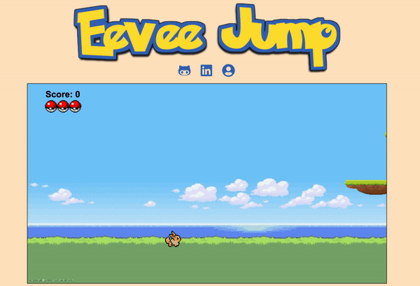

# README


<br/>
<br/>


Eevee Run is a classic runner game based on the Pokemon "eevee". The goal of this game is to collect 20 stones in total in order to evolve Eevee. 

[Click here to play!](https://tnizam.github.io/Eevee-Jump/)

<br/>

# Technologies 
- Javascript
- HTML5 Canvas
- CSS


# Features

Some key features within this game are:
* The ability to move around freely and jump onto platforms within the game.
* At each game play the stones and platforms will render at random.
* When the character comes into contact with the stone it will be collected and the total number of stones will increase in an interval of one.
* After collecting all 20 of the stone then the Eevee will evolve, changing the sprite into a different character.

<br/>

<br/>
<br/>

# Technical challenges 

One challanged I faced when working on this game was trying to collect each stone that the player had collision with. The way I went around this was by using splice to take out that stone from a saved array of stones that was being created.

```
    function stoneCollision() {
        
        for(let i = 0; i < stones.length; i++) {
            if (stoneCollisionCheck(stones[i])) {
                stones.splice(i, 1);
                totalStones += 1;
                scoreCount.innerHTML = totalStones;
            }
        }
    }
```


